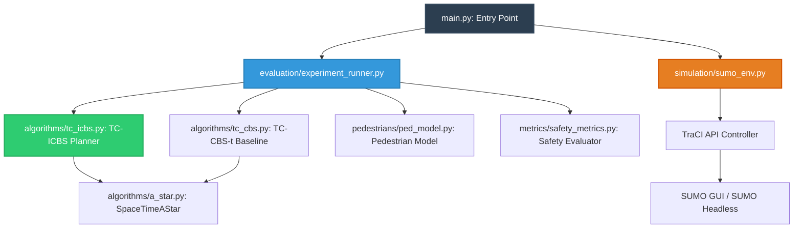
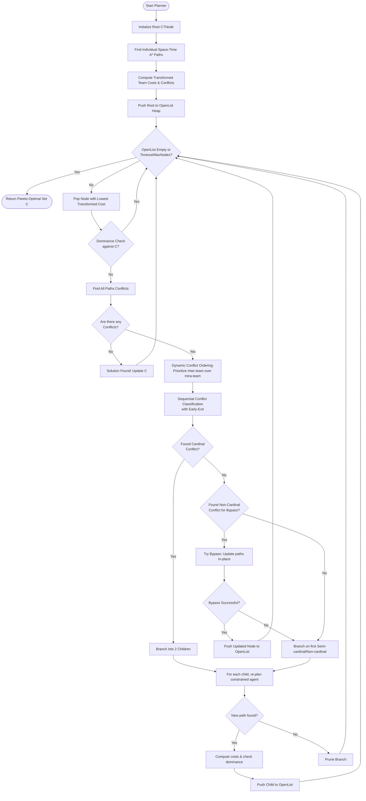
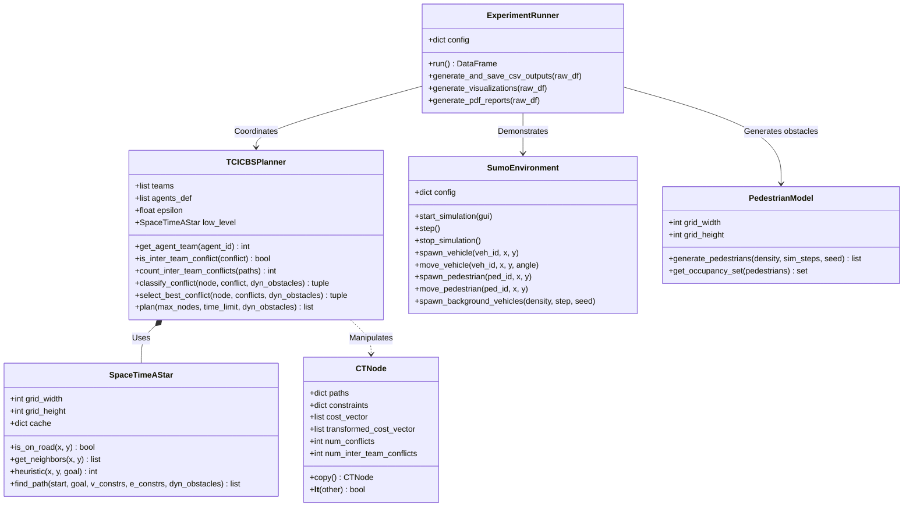
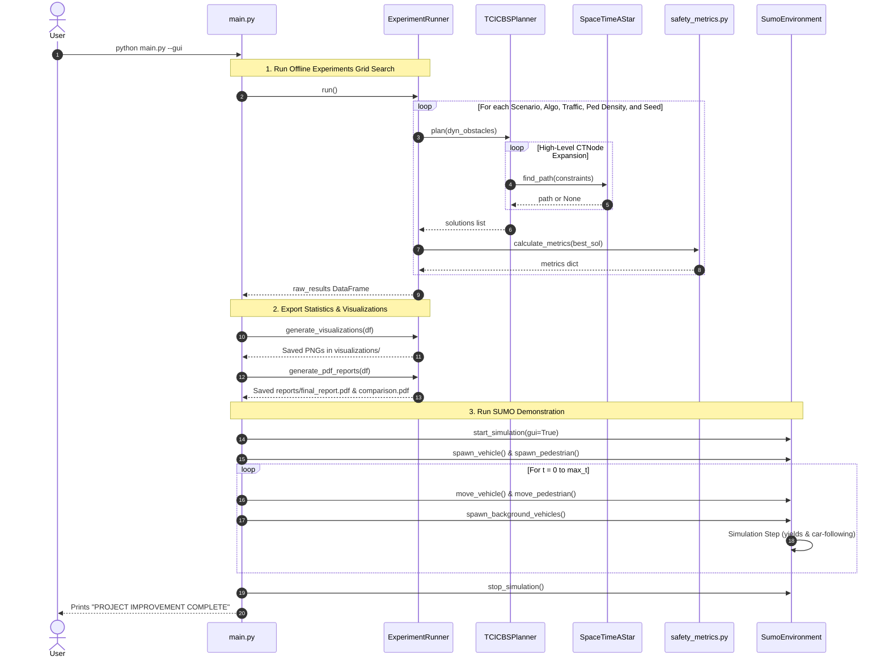
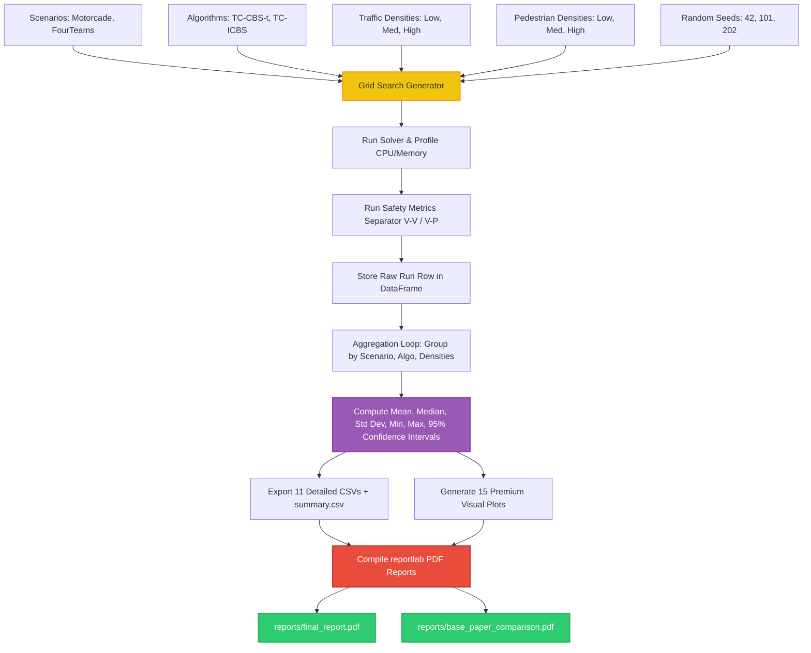

# SafeTCPF System Architecture & Diagram Documentation

This document contains high-fidelity Mermaid diagrams illustrating the architecture, algorithm flow, class relationships, sequence of execution, pipeline, and experimental workflow of the improved **SafeTCPF** framework.

---

## 1. System Architecture Diagram

This diagram shows the modular structure of the SafeTCPF framework and the data flow between different components.

---

## 2. Algorithm Flow Diagram (TC-ICBS)

This diagram details the step-by-step logic of the proposed Teamwise Improved Conflict-Based Search (TC-ICBS) planner, highlighting our **early-exit classification** and **dynamic conflict ordering** optimizations.

---

## 3. Class Diagram

This UML class diagram shows the relationships and major attributes/methods of the core object-oriented modules.

---

## 4. Sequence Diagram (Master Pipeline)

This sequence diagram traces the execution of the entire execution sequence from the `main.py` entry point.

---

## 5. Pipeline Diagram & Experiment Workflow

This diagram maps the experimental grid search pipeline, showing how raw simulation data is processed, aggregated, and compiled into peer-reviewed figures and reports.

