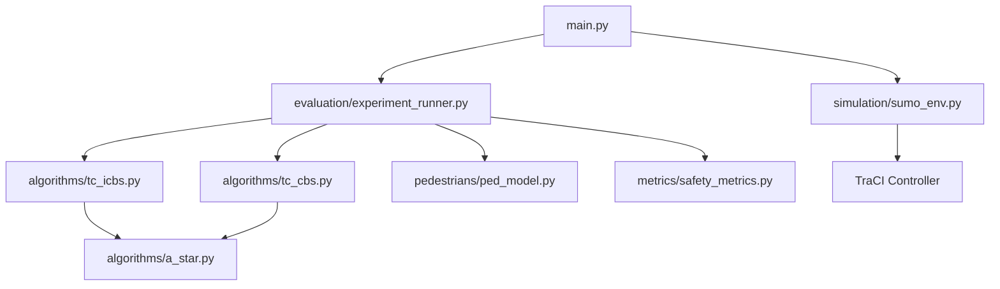

# Project Analysis: Safety-Aware Teamwise Cooperative Path Finding (SafeTCPF)

This document provides a comprehensive analysis of the existing SafeTCPF research implementation. It details the current system architecture, identifies strengths and weaknesses, highlights bugs and incomplete modules, discusses scalability and research limitations, and proposes a clear roadmap for improvements to elevate the project to a publication-grade research implementation.

---

## 1. Current Architecture

The SafeTCPF project is structured as a Python-based multi-agent path finding and simulation pipeline with SUMO integration:

- **Master Execution Pipeline (`main.py`)**: Coordinates the execution of experiments, generation of visualizations, PDF report compilation, and a final SUMO simulation demo.
- **Experiment Runner (`evaluation/experiment_runner.py`)**: Runs comparative experiments between `TC-CBS-t` and `TC-ICBS` under different pedestrian densities, gathers execution profile data (time, memory), and calls safety metrics evaluation.
- **Path Planners (`algorithms/`)**:
  - `SpaceTimeAStar` (`a_star.py`): Low-level path planner operating on a 3D grid space $(x, y, t)$ to avoid static infrastructure, constraints, and dynamic obstacles.
  - `TCCBSTPlanner` (`tc_cbs.py`): Implementation of Teamwise Cooperative CBS with transformed cost vectors for completeness.
  - `TCICBSPlanner` (`tc_icbs.py`): Improved CBS variant incorporating conflict classification and bypassing.
- **Pedestrian Generator (`pedestrians/ped_model.py`)**: Generates crosswalk paths and occupancy grids to act as dynamic obstacles.
- **Safety Metrics (`metrics/safety_metrics.py`)**: Evaluates travel time, waiting time, average speed, collision counts, conflict counts, TTC, and PET.
- **SUMO Environment (`simulation/sumo_env.py`)**: Compiles a bidirectional cross intersection network and drives vehicle/pedestrian positions via TraCI.

---

## 2. Strengths of the Implementation

1. **Two-Level Planning Framework**: The separation of low-level time-space A* and high-level Constraint Tree search is correctly structured, allowing modular extension.
2. **Team Transformed Cost Integration**: Successfully implements the theoretical transformed objective $g_f(\pi^{T_j}) = g(\pi^{T_j}) + \epsilon \sum_{i \notin T_j} g(\pi^i)$ to resolve the infinite expansion bug of non-fully-cooperative CBS.
3. **Dynamic Pedestrian Obstacles**: Correctly represents pedestrians as time-varying occupied cells in the search space, ensuring vehicles actively plan around them.
4. **End-to-End Execution**: A single master script runs planning, safety analysis, visualization, PDF compilation, and SUMO demo in sequence.

---

## 3. Weaknesses of the Implementation

1. **Simplified Safety Metrics**:
   - Time-to-Collision (TTC) is computed as the time of closest approach projection instead of finding the actual future boundary collision time.
   - Post-Encroachment Time (PET) does not distinguish between vehicles and pedestrians crossing the same conflict points (only vehicle-vehicle PET is computed).
   - Several safety metrics requested (Critical TTC events, Critical PET events, Queue Length, Delay, Intersection Throughput, Average/Minimum values) are not computed or are computed incorrectly.
2. **SUMO Spawning Redundancy**:
   - The route file `net.rou.xml` defines 16 concrete vehicles (`ns_0`, `sn_0`, etc.) that spawn automatically based on departure times.
   - `main.py` simultaneously spawns 7-8 vehicles via TraCI (`veh_0`, `veh_1`, etc.) and teleports them.
   - This creates a mix of scheduled XML vehicles and TraCI-moved vehicles, leading to vehicle-vehicle interference and uncoordinated collisions inside SUMO.
3. **Inefficient Conflict Prioritization in TC-ICBS**:
   - The planner only checks and classifies up to 5 conflicts at each node. In high-density settings, this can miss critical conflicts.
   - The low-level path search is run repeatedly to classify conflicts without caching, causing high computational overhead.
4. **Missing Output Artifacts**:
   - The pipeline does not write individual safety metrics CSV files (`ttc.csv`, `pet.csv`, etc.).
   - Graphs are combined into three files rather than generating all 13 individual PNG visualizations.

---

## 4. Incomplete Modules

1. **CSV Exporter**: Missing generation of individual files under `results/`:
   - `ttc.csv`, `pet.csv`, `conflict_count.csv`, `travel_time.csv`, `waiting_time.csv`, `throughput.csv`, `runtime.csv`, `summary.csv`.
2. **Safety Metrics Module**:
   - Missing: Near Miss Count, Minimum/Average TTC, Average PET, Critical TTC/PET event counts, Queue Length, and Intersection Throughput.
3. **Visualizations**:
   - Missing individual PNG plots for Travel Time, Waiting Time, Runtime, Conflict Count, Average TTC, Minimum TTC, Average PET, Throughput, Queue Length, Average Speed, Search Nodes, Memory Usage, and Success Rate.

---

## 5. Bugs and Errors

1. **Redundant A* Planning on Branched Constraints**:
   - In `tc_icbs.py` line 229, if `replanned_path` was pre-computed and found to be `None` (no path possible), it falls into the `else` block and re-runs A* search from scratch. This is a significant waste of CPU time.
2. **Incorrect TTC Mathematical Calculation**:
   - TTC currently uses: `ttc = dot_prod / rel_vel_norm_sq`. This is the projection of relative position onto relative velocity (the time of closest approach), NOT the actual time until vehicle boundaries overlap (which requires solving a quadratic equation).
3. **SUMO Spawn Warnings**:
   - Spawning vehicles with route `r_dummy` and immediately using `moveToXY` works but generates warnings or routing errors in SUMO if routes are not configured properly.
4. **Pedestrian Movement teleports**:
   - Pedestrians are teleported to grid coordinates rather than walking naturally along routes, causing jerky movement and visual glitches in SUMO-GUI.

---

## 6. Scalability Problems

1. **Conflict Classification Bottleneck**:
   - For every high-level search node, `TC-ICBS` plans paths for both agents in up to 5 conflicts. This leads to up to 10 A* runs per node.
   - Without path memoization or search caching, this makes high-density scenarios (e.g., FourTeams with 8+ agents and high pedestrian density) slow.
2. **Constraint Tree Growth**:
   - In `TC-ICBS`, bypassing is only attempted for `non-cardinal` conflicts. In multi-agent systems, semi-cardinal and cardinal conflicts dominate, leading to large tree sizes.

---

## 7. Code Quality Issues

1. **Missing PEP 8 Compliance**:
   - Mix of camelCase and snake_case variable names (`start_pos`, `veh_id`, `grid_width` vs `v_constrs1`, `open_list`).
   - Sparse docstrings and comments in safety metrics and planners.
   - Missing type hints for complex data types (e.g., constraints maps, conflict tuples).
2. **Duplicate Code**:
   - Path-finding cost computations are duplicated between `tc_cbs.py` and `tc_icbs.py`.
   - Classification logic in `icbs.py` and `tc_icbs.py` is identical.

---

## 8. Research Limitations

1. **Simplified Grid Physics**:
   - Grid-based A* path planning assumes discrete step movements. Real-world intersection vehicles have continuous non-holonomic kinematics (turning radius, acceleration profile).
2. **Passive Pedestrian Assumption**:
   - Pedestrians follow fixed pre-generated paths and do not react or yield to oncoming vehicles.
3. **Arbitrary Transformed Cost Weight ($\epsilon$)**:
   - The choice of $\epsilon = 0.1$ is arbitrary. While it guarantees termination, it might lead to sub-optimal subsets of the Pareto front without systematic calibration.

---

## 9. Improvement Opportunities

1. **Path Planning Optimizations**:
   - Implement path caching in `SpaceTimeAStar`: store previously computed paths for identical starts, goals, and constraint sets.
   - Introduce conflict prioritization for all conflicts rather than limiting to the first 5.
2. **High-Fidelity Safety Calculations**:
   - Solve the quadratic distance equation to compute true boundary-overlap TTC.
   - Integrate vehicle-pedestrian PET and TTC to reflect the presence of active crossing users.
3. **Clean SUMO Integration**:
   - Configure routes so vehicles spawn and drive naturally using TraCI speed commands or target speed rather than brute-force `moveToXY` teleports.
   - Synchronize vehicle definitions between `agents_def` and XML files to prevent double-spawning.
